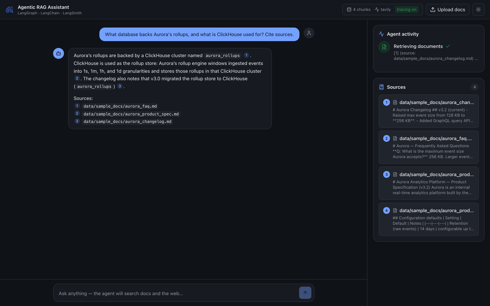
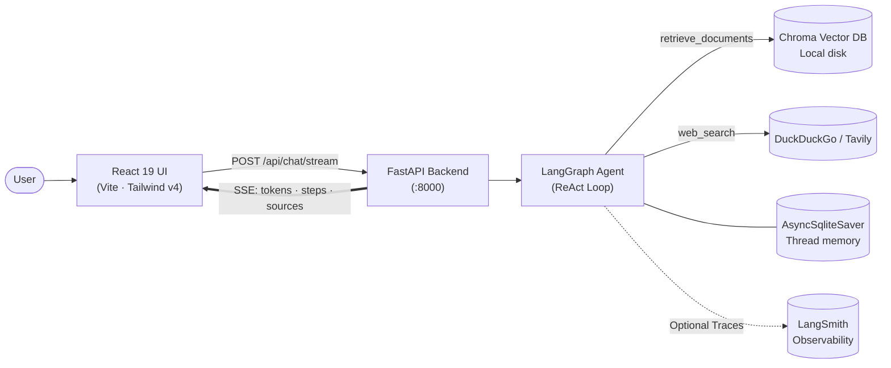
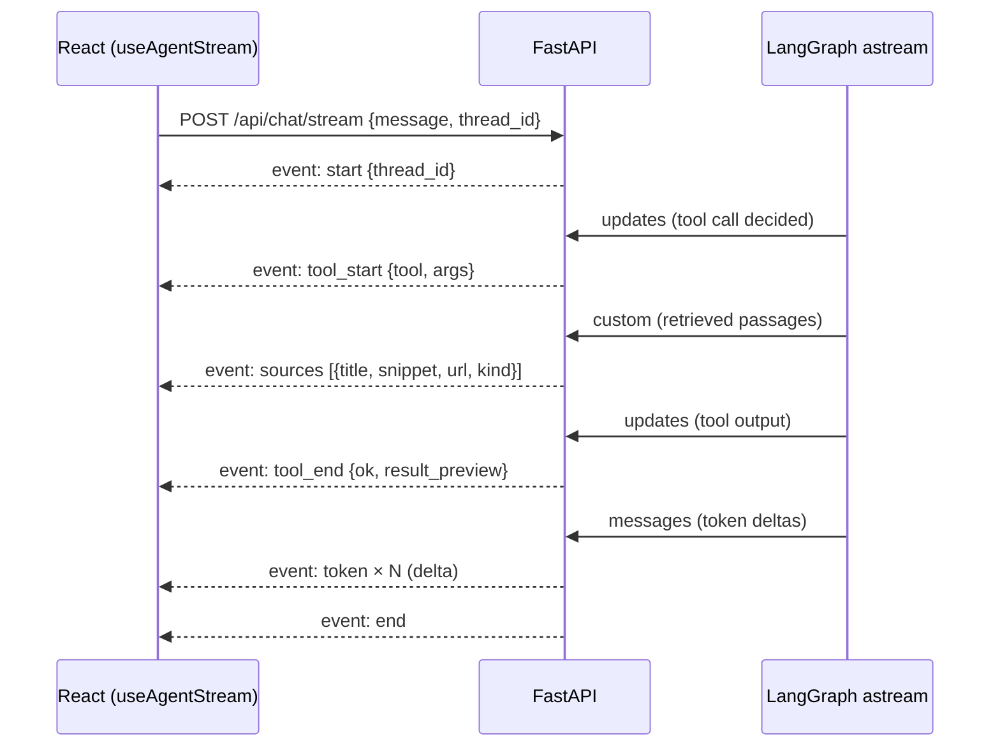

<div align="center">

# 🧠 Nexus AI — Agentic RAG Assistant

### An autonomous AI agent that researches your private documents **and** the live web — streaming every thought, step, and token to a polished React UI with inline citations.

[](https://www.python.org/)
[](https://fastapi.tiangolo.com/)
[](https://python.langchain.com/)
[](https://langchain-ai.github.io/langgraph/)
[](https://react.dev/)
[](https://www.typescriptlang.org/)
[](https://tailwindcss.com/)
[](https://www.trychroma.com/)



</div>

---

## 📖 Table of Contents
- [✨ Overview](#-overview)
  - [💡 In Simple Words (High-Level Overview)](#-in-simple-words-high-level-overview)
  - [🔬 In Extreme Technical Depth (Architecture & Internals)](#-in-extreme-technical-depth-architecture--internals)
- [🏗️ System Architecture](#️-system-architecture)
  - [The ReAct Decision Loop](#the-react-decision-loop)
  - [Real-Time SSE Streaming Pipeline](#real-time-sse-streaming-pipeline)
- [⚡ Key Features](#-key-features)
- [🧰 Tech Stack](#-tech-stack)
- [📂 Project Directory Structure](#-project-directory-structure)
- [🚀 Quickstart & Setup Guide](#-quickstart--setup-guide)
  - [1. Clone Repository](#1-clone-repository)
  - [2. Environment Configuration (.env)](#2-environment-configuration-env)
  - [3. Backend Launch (FastAPI + Python 3.12)](#3-backend-launch-fastapi--python-312)
  - [4. Frontend Launch (React 19 + Vite)](#4-frontend-launch-react-19--vite)
  - [🐳 Optional: Docker Compose Deployment](#-optional-docker-compose-deployment)
- [🔌 API Reference](#-api-reference)
- [🔬 Observability & Evaluations](#-observability--evaluations)
- [👨‍💻 Author](#-author)

---

## ✨ Overview

### 💡 In Simple Words (High-Level Overview)
Standard RAG (Retrieval-Augmented Generation) is like an assistant who fetches one document and answers immediately—even if the document doesn't have the answer or is outdated.

**Agentic RAG Assistant** works like a **senior research scientist**:
1. **Understands Intent:** It reads your question and figures out what information is missing.
2. **Consults Multiple Knowledge Sources:** It first checks your **private documents** stored in its local vector database. If the answer requires fresh or external facts, it autonomously browses the **live web** (via DuckDuckGo or Tavily).
3. **Iterative Reasoning (ReAct):** If the first search is incomplete, it refines its search query and digs deeper until it has verified facts.
4. **Verifiable Citations:** When synthesizing the answer, every factual statement is backed by clickable numeric badges (`[1]`, `[2]`) pointing to exact document snippets or live web URLs.
5. **Interactive UI:** Rather than a static loading spinner, the UI shows you the agent's **live thought process**—which tools it started, what it found, and tokens streamed in real time.

---

### 🔬 In Extreme Technical Depth (Architecture & Internals)
Under the hood, this project is built as a production-grade asynchronous agentic pipeline:

- **LangGraph Agent Core:** Compiled via LangGraph's `create_agent` with thread-level state checkpointing using `AsyncSqliteSaver`. It manages a stateful message graph where tool calls form cyclical feedback edges (`model` ↔ `tools`) until a termination criterion is met.
- **Provider-Agnostic LLM Layer (Google Gemini + OpenAI):** 
  - Supports **Google Gemini 3.5 Flash / Flash-Lite** via an OpenAI-compatible gateway with zero hosting costs.
  - **Thought Signature Preservation Engine:** Solves Google Gemini's requirement for cryptographic `thought_signature` tokens during multi-turn function calling. A custom monkey-patch intercepts `ChoiceDeltaToolCall` and preserves `extra_content` so tool messages never trigger `400 INVALID_ARGUMENT`.
  - **Resilient Exponential Backoff:** Automatic retry handling (`max_retries=5`) guards against 429 rate limit spikes during intensive multi-tool research turns.
  - Fully compatible with OpenAI `gpt-5` / `gpt-4o` models via standard API configuration.
- **Native Dual-Source Retrieval:**
  - **Dense Document Vector Store:** Chroma DB persisted locally on disk. Documents (PDFs, Markdown, TXT) are split using LangChain's `RecursiveCharacterTextSplitter` (chunk size: 1000, overlap: 150) and transformed into 3072-dimensional vector embeddings via `gemini-embedding-001` or OpenAI `text-embedding-3-small`.
  - **Live Web Search:** Dynamic search router that leverages Tavily Search API when configured, gracefully degrading to a keyless DuckDuckGo search fallback without crashing.
- **Multi-Channel SSE Streaming Bridge:** 
  Uses `agent.astream(stream_mode=["messages", "updates", "custom"])`. The FastAPI server maps asynchronous generator chunks into flat Server-Sent Events (`start`, `tool_start`, `sources`, `tool_end`, `token`, `end`), allowing the React client to render intermediate states with zero latency.
- **React 19 & TypeScript Frontend:** Built with React 19, Vite, and Tailwind CSS v4. Features a decoupled reducer-based streaming hook (`useAgentStream`), accessible dark mode, Shiki-powered syntax highlighting, and interactive source inspectors.

---

## 🏗️ System Architecture



### The ReAct Decision Loop

```mermaid
flowchart TD
    S([User Message]) --> M["Model Node<br/>(gemini-3.5-flash-lite / gpt-5)"]
    M --> D{Tool Calls Needed?}
    D -->|Yes| T["Tools Node<br/>retrieve_documents · web_search"]
    T -->|Emit Sources + Tool Results| M
    D -->|No| E([Synthesize Final Answer with [n] Citations])
```

### Real-Time SSE Streaming Pipeline



| Event | Channel | Payload | Description |
|---|---|---|---|
| `start` | — | `{ thread_id }` | Initializes conversation stream turn |
| `tool_start` | `updates` | `{ id, tool, args }` | Renders running tool indicator in timeline |
| `sources` | `custom` | `{ tool, sources: [...] }` | Immediately populates interactive source drawer |
| `tool_end` | `updates` | `{ id, tool, ok, result_preview }` | Marks tool step as done or failed |
| `token` | `messages` | `{ delta, node }` | Live token stream for typewriter effect |
| `end` | — | `{ thread_id }` | Concludes chat turn and updates thread state |

---

## ⚡ Key Features

- 🤖 **Agentic ReAct Loop:** Not a fixed linear chain; the agent decides what to search, when to stop, and how to verify facts.
- 📚 **Dual-Mode Retrieval:** Queries internal knowledge bases (Chroma DB) and the live internet (DuckDuckGo / Tavily).
- 🆓 **100% Free Tier Out-of-the-Box:** Preconfigured to run entirely on Google Gemini's free tier with zero API charges.
- ⚡ **Real-Time Token & Tool Streaming:** Live step execution timeline, tool previews, and immediate source cards.
- 🔗 **Clickable Inline Citations:** Statements link to `[1]`, `[2]` chips that highlight the corresponding document chunk or web URL.
- 📂 **Drag-and-Drop Document Ingestion:** Upload `.pdf`, `.txt`, or `.md` files directly in the UI to dynamically augment the vector database.
- 💾 **Persistent Session Memory:** `AsyncSqliteSaver` maintains multi-turn conversation context across user threads.
- 🎨 **Modern React 19 UI:** Built with Tailwind CSS v4, Shiki syntax highlighting, and seamless Dark/Light theme toggle.

---

## 🧰 Tech Stack

| Layer | Technologies |
|---|---|
| **Agent & Workflow** | LangGraph 1.2 (`create_agent`, `AsyncSqliteSaver`), LangChain 1.3 |
| **LLMs & Embeddings** | Google Gemini (`gemini-3.5-flash-lite`, `gemini-embedding-001`) / OpenAI (`gpt-5`, `text-embedding-3-small`) |
| **Vector Storage** | Chroma DB (Persisted to disk) with `RecursiveCharacterTextSplitter` |
| **Web Retrieval** | DuckDuckGo (Keyless fallback) · Tavily Search API |
| **Backend API** | FastAPI · `sse-starlette` · `pydantic-settings` · Python 3.12 |
| **Frontend UI** | React 19 · Vite · TypeScript · Tailwind CSS v4 · Shiki · Lucide Icons |
| **Package Management** | Astral `uv` (Python) · `npm` (Node.js) |

---

## 📂 Project Directory Structure

```
Agentic-RAG-Assistant/
├── src/
│   └── rag_agent/
│       ├── __init__.py
│       ├── agent.py         # LangGraph ReAct agent builder & system instructions
│       ├── api.py           # FastAPI application & endpoints (/health, /chat/stream, /ingest)
│       ├── config.py        # Settings loader with pydantic-settings
│       ├── embeddings.py    # Native Gemini & OpenAI embeddings factory
│       ├── ingest.py        # PDF/Text loaders, chunking & Chroma ingestion logic
│       ├── llms.py          # Model factory, retry handler & thought_signature patch
│       ├── schemas.py       # Pydantic schemas for request/response validation
│       ├── streaming.py     # Multi-channel astream to flat SSE event transformer
│       ├── tools.py         # retrieve_documents (RAG) & web_search tools
│       └── vectorstore.py   # Chroma DB persistent collection manager
├── frontend/
│   ├── src/
│   │   ├── components/      # ChatPanel, ActivityTimeline, SourcesPanel, AppShell
│   │   ├── hooks/           # useAgentStream.ts (SSE state machine hook)
│   │   ├── lib/             # api.ts (HTTP client), sse.ts (stream reader)
│   │   ├── App.tsx          # Main React Application component
│   │   └── main.tsx
│   ├── package.json
│   ├── vite.config.ts       # Vite configuration with /api reverse proxy
│   └── Dockerfile
├── data/
│   └── sample_docs/         # Sample Aurora Analytics platform documentation
├── evals/                   # LangSmith automated evaluation scripts & datasets
├── .env.example             # Template configuration file
├── docker-compose.yml       # Docker Compose multi-container setup
├── Dockerfile.backend       # Backend container definition
└── pyproject.toml           # Python dependencies and project metadata
```

---

## 🚀 Quickstart & Setup Guide

### 1. Clone Repository

```bash
git clone https://github.com/AnandPatekhede16/Agentic-Rag_Assistant.git
cd Agentic-Rag_Assistant
```

---

### 2. Environment Configuration (.env)

Create your local `.env` configuration file from the provided template:

```bash
cp .env.example .env
```

#### Option A: Google Gemini Free Tier (100% Free - Recommended)
1. Get a free API key at **[Google AI Studio](https://aistudio.google.com/)**.
2. Update your `.env`:
```env
OPENAI_API_KEY=your_gemini_api_key_here
OPENAI_BASE_URL=https://generativelanguage.googleapis.com/v1beta/openai/
MODEL_FAST=gemini-3.5-flash-lite
MODEL_HEAVY=gemini-3.5-flash-lite
EMBEDDING_MODEL=models/gemini-embedding-001

# Web search falls back automatically to keyless DuckDuckGo
TAVILY_API_KEY=
LANGSMITH_TRACING=false
```

#### Option B: OpenAI (Standard)
```env
OPENAI_API_KEY=sk-your-openai-api-key
OPENAI_BASE_URL=
MODEL_FAST=gpt-5.4-mini
MODEL_HEAVY=gpt-5.5
EMBEDDING_MODEL=text-embedding-3-small
```

---

### 3. Backend Launch (FastAPI + Python 3.12)

The project uses [uv](https://github.com/astral-sh/uv) for fast, reproducible dependency management:

```bash
# 1. Install uv (if not already installed)
# Windows (PowerShell):
powershell -ExecutionPolicy ByPass -c "irm https://astral.sh/uv/install.ps1 | iex"

# macOS/Linux:
curl -LsSf https://astral.sh/uv/install.sh | sh

# 2. Sync virtual environment and install dependencies
uv sync

# 3. Start the FastAPI backend server
uv run uvicorn rag_agent.api:app --reload --port 8000
```

> **Note:** On first startup, the backend automatically seeds `data/sample_docs/` into the local Chroma vector store. Check `http://localhost:8000/api/health` to verify.

---

### 4. Frontend Launch (React 19 + Vite)

Open a **separate terminal** window:

```bash
# 1. Navigate to the frontend directory
cd frontend

# 2. Install Node.js packages
npm install

# 3. Start Vite development server
npm run dev
```

Now open your browser and navigate to:
👉 **`http://localhost:5173`**

---

### 🐳 Optional: Docker Compose Deployment

To build and run both services with a single command via Docker:

```bash
docker compose up -d --build
```
- **UI:** `http://localhost:8080`
- **Backend API:** `http://localhost:8000/api/health`

---

## 🔌 API Reference

| Method | Endpoint | Description |
|---|---|---|
| `GET` | `/api/health` | Returns active models, indexed chunk count, and search backend status. |
| `POST` | `/api/chat/stream` | Primary SSE chat endpoint. Accepts `{ "message": str, "thread_id": str }`. |
| `POST` | `/api/ingest` | Multipart file upload endpoint. Ingests `.pdf`, `.txt`, `.md` into Chroma DB. |
| `POST` | `/api/feedback` | Submits thumbs up/down user feedback to LangSmith. |

#### Example Stream Query:
```bash
curl -N -X POST http://localhost:8000/api/chat/stream \
  -H "Content-Type: application/json" \
  -d '{"message": "What authentication protocol does Aurora use? Cite sources."}'
```

---

## 🔬 Observability & Evaluations

Enable LangSmith tracing by setting `LANGSMITH_TRACING=true` and `LANGSMITH_API_KEY` in `.env`.

To run automated offline benchmark evaluations:
```bash
# Seed the evaluation dataset
uv run python -m evals.create_dataset

# Run evaluation experiment across correctness, relevance, and groundedness
uv run python -m evals.run_evals

# Run pairwise model comparison
uv run python -m evals.run_pairwise
```

---

## 👨‍💻 Author

**Anand Patekhede**
- **GitHub:** [@AnandPatekhede16](https://github.com/AnandPatekhede16)
- **Repository:** [Agentic-Rag_Assistant](https://github.com/AnandPatekhede16/Agentic-Rag_Assistant)
